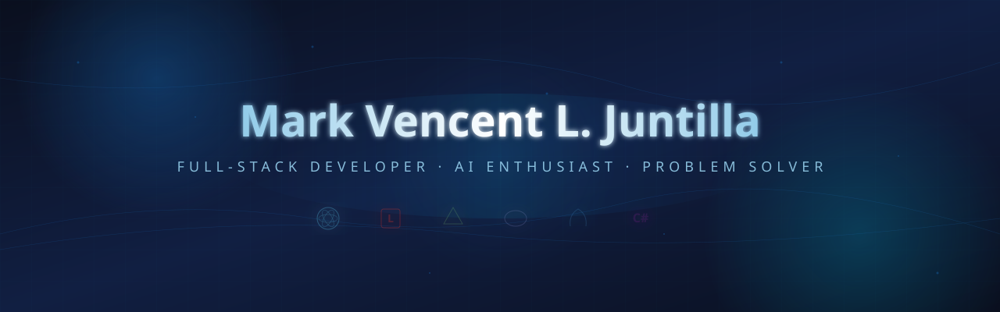

<p align="center">
  <a href="https://github.com/makinity">
    
  </a>
</p>

<h1 align="center">Mark Vencent L. Juntilla</h1>

<p align="center">
  
</p>

<p align="center">
  <a href="https://github.com/makinity">
    
  </a>
  
  
  
</p>

<br/>

---

<br/>

## About Me

<table>
<tr>
<td width="120" align="center">
  
</td>
<td>

I'm a fourth-year **BSIT student** and **full-stack developer** from the Philippines, passionate about building software that solves real-world problems.

I specialize in **Laravel**, **React.js**, **Next.js**, and **React Native**, with growing expertise in **AI integration**, **system architecture**, and **cloud technologies**. I approach every project with a planning-first mindset — understanding the problem before writing a single line of code.

When I'm not coding, I'm probably learning something new, automating my workflows, or helping businesses grow through **Social Media Management** and **Virtual Assistance**.

**What drives me:** Building technology that makes a difference. Every project is an opportunity to learn, improve, and create something meaningful.

</td>
</tr>
</table>

<br/>

---

<br/>

## 💡 Developer Philosophy

> *"Software development begins with planning, not coding. Every great system starts with understanding the problem, designing the architecture, and building for maintainability."*

<br/>

<table>
<tr>
<td width="32%" align="center">

**🎯 Plan First**
<br/>
<sub>Understand → Research → Design → Build</sub>

</td>
<td width="32%" align="center">

**🏗️ Build Right**
<br/>
<sub>Clean architecture, separation of concerns</sub>

</td>
<td width="32%" align="center">

**📈 Scale Fast**
<br/>
<sub>Code for today, architect for tomorrow</sub>

</td>
</tr>
</table>

<br/>

---

<br/>

## 🛠️ Tech Stack

<br/>

<table>
<tr>
<td width="50%" valign="top">

**Frontend**
<br/>
<br/>


</td>
<td width="50%" valign="top">

**Backend**
<br/>
<br/>


</td>
</tr>
<tr>
<td width="50%" valign="top">

**Database & Cloud**
<br/>
<br/>


</td>
<td width="50%" valign="top">

**Tools & AI**
<br/>
<br/>


</td>
</tr>
</table>

<br/>

---

<br/>

## 🚀 Featured Projects

<br/>

<table>
<tr>
<td width="50%" valign="top">

### 🏠 BoardEase

> A full-stack boarding house management system that handles the complete rental lifecycle: **search → reserve → rent → bill → pay**.

<br/>

**Stack:**
<br/>


<br/>

**Highlights:**
- 🖥️ WPF Desktop App (.NET 8) + 📱 React Native Mobile App
- 🎫 Role-based access (Admin, Owner, Occupant)
- 💳 Stripe & PayMongo payment integration
- 🔔 Real-time notifications via SignalR
- 🤖 Built-in AI assistant (Gemini)
- 📊 Reports & analytics

<br/>

<a href="https://github.com/makinity/BoardEase-APP">
  
</a>
<a href="https://github.com/makinity/BoardEase-Mobile">
  
</a>

</td>
<td width="50%" valign="top">

### 📊 Smart PMS

> A Smart Performance Management System integrating **machine learning** with modern web technologies for data-driven performance evaluation.

<br/>

**Stack:**
<br/>


<br/>

**Highlights:**
- 🧠 Random Forest ML model for performance prediction
- 📈 Data visualization & analytics dashboard
- 🏗️ Laravel backend with clean architecture
- 🎯 Role-based dashboards
- ⭐ Employee evaluation system
- 📋 Department management

<br/>

<a href="https://github.com/makinity/Smart-PMS">
  
</a>

</td>
</tr>
<tr>
<td width="50%" valign="top">

### 🎯 JobHunter AI

> An AI-powered personal automation system that monitors Facebook groups for **SMM/VA freelance gigs** and sends instant notifications via Telegram.

<br/>

**Stack:**
<br/>


<br/>

**Highlights:**
- 🤖 AI-powered job matching with Groq (LLaMA 3.1)
- 🔍 Puppeteer-based Facebook scraper
- 📱 Telegram bot notifications
- ⏰ Scheduled monitoring with GitHub Actions
- 📊 Match scoring & skill profiling
- 🔄 Auto cookie expiry reminders

<br/>

<a href="https://github.com/makinity/jobhunter-ai">
  
</a>

</td>
<td width="50%" valign="top">

### 🌐 MakiSync

> My personal brand portfolio website — a modern, minimal landing page showcasing services, projects, and professional capabilities.

<br/>

**Stack:**
<br/>


<br/>

**Highlights:**
- 🎨 Consistent MakiSync branding (#1683DF, #93CCE9)
- 📱 Fully responsive design
- ⚡ Deployed on Vercel
- 🏗️ Service showcase (SMM, VA, Web Dev)
- 📄 Project portfolio integration
- 📈 SEO-optimized

<br/>

<a href="https://maki-sync.vercel.app">
  
</a>
<a href="https://github.com/makinity/MakiSync">
  
</a>

</td>
</tr>
</table>

<br/>

---

<br/>

## 📊 GitHub Stats

<br/>

<table>
<tr>
<td width="50%" align="center">


</td>
<td width="50%" align="center">


</td>
</tr>
</table>

<br/>

<table>
<tr>
<td width="50%" align="center">


</td>
<td width="50%" align="center">

<a href="https://github.com/ashutosh00710/github-readme-activity-graph">
  
</a>

</td>
</tr>
</table>

<br/>

---

<br/>

## 🐍 Contribution Snake

<br/>

<p align="center">
  
</p>

> *🔄 Updated automatically every 12 hours via GitHub Actions*

<br/>

---

<br/>

## 🏆 Achievements

<br/>

<p align="center">
  
  
  
  
  
</p>

<p align="center">
  
  
  
  
  
</p>

<br/>

---

<br/>

## 🧠 What I'm Currently Working On

<br/>

<table>
<tr>
<td width="33%" align="center">

**🎓 Academics**
<br/>
Completing BSIT degree
<br/>
<sub>Expected graduation: 2026</sub>

</td>
<td width="33%" align="center">

**🏗️ BoardEase**
<br/>
Full-stack boarding house system
<br/>
<sub>Desktop + Mobile + API</sub>

</td>
<td width="33%" align="center">

**🤖 AI Integration**
<br/>
Learning ML & AI patterns
<br/>
<sub>Gemini API, Groq, automation</sub>

</td>
</tr>
</table>

<table>
<tr>
<td width="33%" align="center">

**☁️ Cloud & DevOps**
<br/>
AWS Cloud Practitioner
<br/>
<sub>Building deployment skills</sub>

</td>
<td width="33%" align="center">

**💼 Freelancing**
<br/>
SMM & VA services
<br/>
<sub>Building portfolio & clients</sub>

</td>
<td width="33%" align="center">

**🚀 MakiSync**
<br/>
Expanding personal brand
<br/>
<sub>Services, portfolio, products</sub>

</td>
</tr>
</table>

<br/>

---

<br/>

## 🎯 Goals & Ambitions

<br/>

```
🎯 SHORT-TERM (3-6 months)
├── ✅ MakiSync Portfolio Website — Complete
├── ✅ BoardEase — Full-stack system — Complete
├── ✅ Smart PMS — ML-integrated system — Complete
├── 🔨 Secure remote position (Software Engineer / VA)
├── 🔨 Build 3-5 paying freelance clients
├── 🔨 AWS Cloud Practitioner certification
└── 🔨 Earn stable income ₱20K-₱40K/month

🎯 MID-TERM (6-12 months)
├── 🎓 Graduate with BSIT degree
├── 📊 Build professional SMM portfolio
├── 💰 Achieve consistent ₱40K+/month
└── 🏗️ Establish MakiSync as umbrella brand

🎯 LONG-TERM (1-3 years)
├── 🌍 Financial independence through remote work
├── 🚀 Launch own SaaS product
├── 🏢 Build technology business
└── ✈️ Travel internationally
```

<br/>

---

<br/>

## 🤝 Let's Connect

<br/>

<p align="center">
  <a href="https://maki-sync.vercel.app">
    
  </a>
  <a href="https://github.com/makinity">
    
  </a>
  <a href="https://www.linkedin.com/in/mark-vencent-juntilla-366328358">
    
  </a>
  <a href="mailto:markjuntillava@gmail.com">
    
  </a>
  <a href="https://t.me/MakiSyncBot">
    
  </a>
</p>

<br/>

<p align="center">
  <sub>💬 <b>Available for:</b> Remote Software Engineering roles · Freelance Web Development · SMM & Virtual Assistance</sub>
</p>

<br/>

---

<br/>

<p align="center">
  <a href="https://github.com/makinity">
    
  </a>
</p>

<p align="center">
  
</p>

<p align="center">
  <sub>⚡ Built with precision · Powered by passion · Driven by purpose</sub>
</p>
